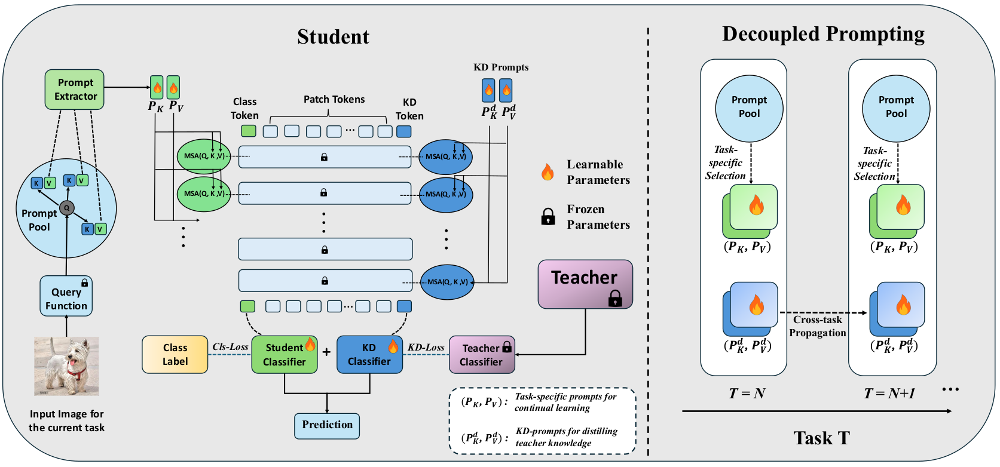

##  Continual Distillation Learning
PyTorch code for the paper:\
**Decoupled Prompting for Continual Distillation in Rehearsal-Free Class-Incremental Learning**\
Qifan Zhang, Yunhui Guo, Yu Xiang

[arXiv](https://arxiv.org/abs/2407.13911), [Project](https://irvlutd.github.io/CDL/)

<p align="center">

</p>

## Abstract
Prompt-based continual learning has shown strong performance in rehearsal-free class-incremental learning by adapting learnable prompts while freezing a pre-trained Vision Transformer (ViT) backbone. However, the effect of backbone scale remains underexplored. We observe that larger ViT backbones consistently yield better continual learning performance, which motivates us to study how to transfer such capability from a larger model to a smaller one. In this paper, we introduce Continual Distillation Learning (CDL), a new setting for knowledge distillation in rehearsal-free prompt-based continual learning. We show that conventional distillation methods provide only limited gains in CDL, mainly because task-specific prompts are forced to encode both continual adaptation and distillation knowledge, while lacking a persistent mechanism for cross-task knowledge transfer. To address this problem, we propose Decoupled Continual Distillation Learning (D-CDL), which introduces persistent Knowledge-Distillation prompts (KD-prompts) and a dedicated KD branch to explicitly decouple distillation from task adaptation. The proposed KD-prompts are propagated across tasks as a global carrier of teacher knowledge, while the original prompts remain responsible for continual learning. D-CDL is simple, general, and can be integrated into various prompt-based continual learning frameworks. Extensive experiments on Split CIFAR-100 and Split ImageNet-R across four representative continual learning methods show that D-CDL consistently outperforms existing distillation baselines and substantially improves student performance under different teacher-student settings.


## Setup
 * set up conda environment w/ python 3.8, ex: `conda create --name CDL python=3.8`
 * `conda activate CDL`
 * `sh install_requirements.sh`
 
## Datasets
 * Create a folder `data/`
 * **CIFAR 100**: should automatically be downloaded
 * **ImageNet-R**: retrieve from: https://github.com/hendrycks/imagenet-r
 * **./data** should be a folder with the following structure:
```bash
  ./data  
  ├── cifar-100-python  
  ├── imagenet-r  
  │   ├── n01443537  
  │   │   ├── art_0.jpg  
  │   │   ├── cartoon_0.jpg  
  │   │   ├── graffiti_0.jpg
  │   │   └── ...
  │   ├── n01833805  
  │   │   ├── art_0.jpg  
  │   │   ├── cartoon_0.jpg  
  │   │   ├── graffiti_0.jpg
          └── ... 
```

## Training
**The scripts are set up for 2 GPUs** but can be modified for your hardware. You can directly run the run.py and test on ImageNet-R dataset:

```bash
python -u run.py --config configs/imnet-r_prompt.yaml --gpuid 0 1 \
    --learner_type prompt --learner_name CODAPrompt \
    --prompt_param 100 8 0.0 \
    --log_dir ImageNet_R/coda-p \
    --t_model 'vit_base_patch16_224' \
    --s_model 'vit_small_patch16_224' \
    --KD_method 'KD_Token' \
    --kd_prompt_param 12 6
```
* Check the experiments/imagenet-r.sh and experiments/cifar-100.sh to see the details.
* You can change the learner_name for DualPrompt or L2P.
* Change the prompt_param for different learner(CODA, DualPrompt, L2P or APT)
* You can adjust the teacher and student's model with --t_model and --s_model.
* Change the --KD_method for different knowledage distillation methods -> ['KD_Token', 'KD', 'DKD', 'FitNets', 'ReviewKD']. Use the 'KD_Token' for our ***DCDL*** model.
* Change the --kd_prompt_param for our ***CDL*** model (kd_layers size, kd_prompt_length).


## Results

The results will be saved in the created --log_dir folder, including the models for the teacher and student as well as the final average accuracy for both the teacher and student.

<!-- ## Citation
If you find the method useful in your research, please consider citing:
```latex
@misc{lu2024adapting,
    title={Continual Distillation Learning},
    author={Qifan Zhang and Yunhui Guo and Yu Xiang},
    year={2024},
    eprint={2407.13911},
    archivePrefix={arXiv},
    primaryClass={cs.CV}
}
``` -->

## Acknowledgments

This project is based on the following repositories:
- [CODA-Prompt](https://github.com/GT-RIPL/CODA-Prompt)
- [L2P-Pytorch](https://github.com/JH-LEE-KR/l2p-pytorch)


