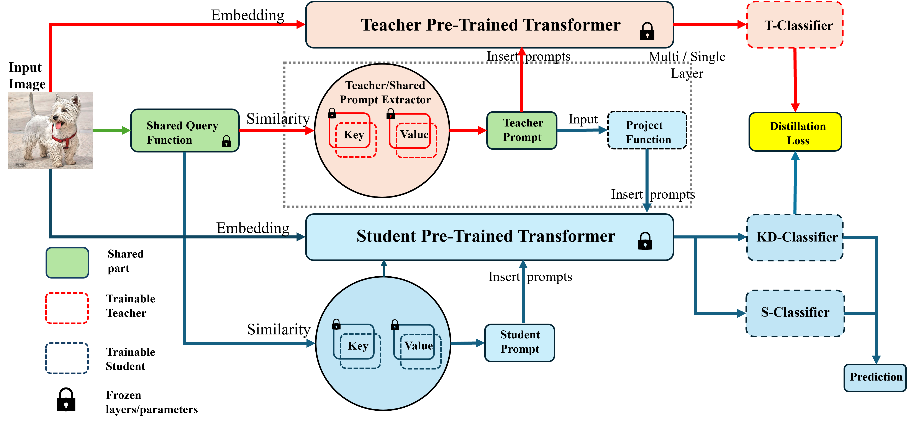

##  Continual Distillation Learning
PyTorch code for the paper:\
**Continual Distillation Learning**\
**_[Qifan Zhang]_**, Yunhui Guo, Yu Xiang

<p align="center">

</p>

## Abstract
We study the problem of Continual Distillation Learning (CDL) that considers Knowledge Distillation (KD) in the Continual Learning (CL) setup. A teacher model and a student model need to learn a sequence of tasks, and the knowledge of the teacher model will be distillated to the student in order to improve the student model. We introduce a novel method named CDL-Prompt that leverages prompt-based continual learning models to build the teacher-student model. We investigate how to utilize the prompts of the teacher model in the student model for knowledge distillation, and propose an attention-based prompt mapping scheme to use the teacher prompts for the student. We demonstrate that our method can be applied to different prompt-based continual learning models such as L2P, DualPrompt and CODA-Prompt to improve their performance using powerful teacher models. While recent CL methods focus on prompt learning, we show that our method can be utilized to build efficient CL models using prompt-based knowledge distillation.


## Setup
 * Install anaconda: https://www.anaconda.com/distribution/
 * set up conda environment w/ python 3.8, ex: `conda create --name coda python=3.8`
 * `conda activate coda`
 * `sh install_requirements.sh`
 * <b>NOTE: this framework was tested using `torch == 2.0.0` but should work for previous versions</b>
 
## Datasets
 * Create a folder `data/`
 * **CIFAR 100**: should automatically be downloaded
 * **ImageNet-R**: retrieve from: https://github.com/hendrycks/imagenet-r
 * **DomainNet**: retrieve from: http://ai.bu.edu/M3SDA/

## Training
All commands should be run under the project root directory. **The scripts are set up for 2 GPUs** but can be modified for your hardware.

```bash
sh experiments/cifar100.sh
sh experiments/imagenet-r.sh
```

## Results

## Acknowledgement
This work was supported in part by the DARPA Perceptually-enabled Task Guidance (PTG) Program.


